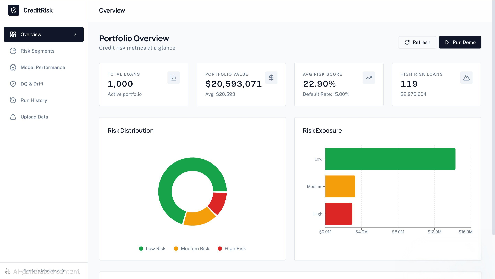
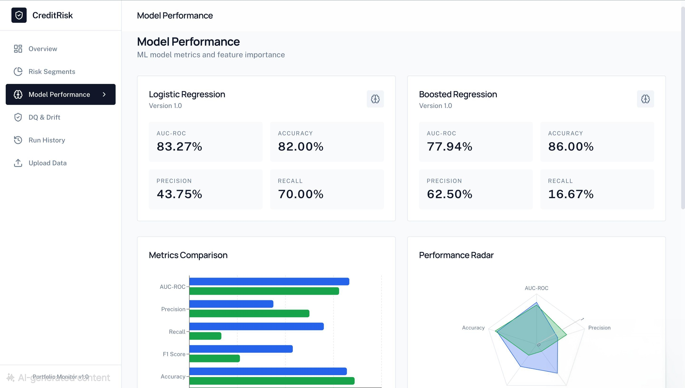
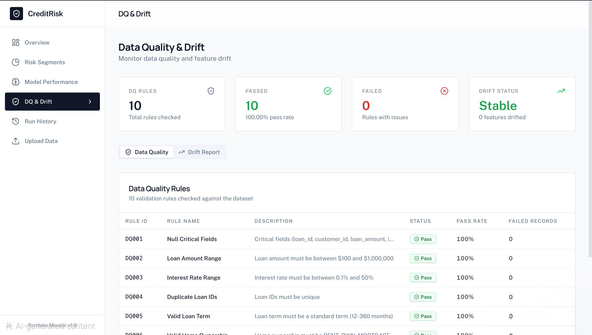
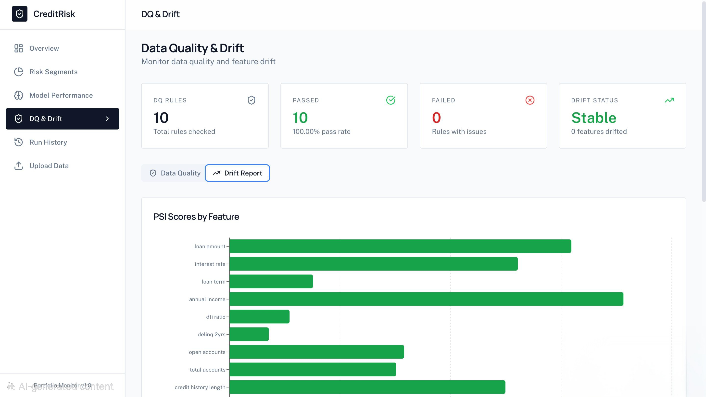

# Credit Risk Portfolio Monitor
**Live Demo:** https://credit-risk-portfolio-monitor-e5il366yw.vercel.app
**Backend API (Render):** https://credit-risk-backend-bvje.onrender.com/docs
**GitHub Repo:** https://github.com/saiswaroop263/credit-risk-portfolio-monitor

A full-stack web application for credit risk analysis, monitoring, and reporting. Upload loan data, run ML models, and visualize portfolio risk metrics through an intuitive dashboard.


## Architecture

```
┌─────────────────────────────────────────────────────────────────────────┐
│                           FRONTEND (React)                               │
│  ┌──────────┐ ┌──────────┐ ┌──────────┐ ┌──────────┐ ┌──────────┐      │
│  │Dashboard │ │   Risk   │ │  Model   │ │ DQ/Drift │ │  Upload  │      │
│  │ Overview │ │ Segments │ │   Perf   │ │  Report  │ │   Data   │      │
│  └──────────┘ └──────────┘ └──────────┘ └──────────┘ └──────────┘      │
└────────────────────────────────┬────────────────────────────────────────┘
                                 │ REST API
┌────────────────────────────────┴────────────────────────────────────────┐
│                          BACKEND (FastAPI)                               │
│  ┌──────────────────────────────────────────────────────────────────┐   │
│  │                         API Endpoints                              │   │
│  │  POST /api/upload  POST /api/runs/{run_id}/execute  POST /api/demo                │   │
│  │  GET /api/runs     GET /api/kpis    GET /api/scores    GET /api/dq    GET /api/drift  │   │
│  └──────────────────────────────────────────────────────────────────┘   │
│  ┌─────────┐ ┌─────────┐ ┌─────────┐ ┌─────────┐ ┌─────────┐          │
│  │   ETL   │ │   DQ    │ │   ML    │ │  Drift  │ │  Demo   │          │
│  │Pipeline │ │ Rules   │ │ Models  │ │Detection│ │  Data   │          │
│  └─────────┘ └─────────┘ └─────────┘ └─────────┘ └─────────┘          │
└────────────────────────────────┬────────────────────────────────────────┘
                                 │
┌────────────────────────────────┴────────────────────────────────────────┐
│                          DATABASE (MongoDB)                              │
│  ┌─────────────┐ ┌─────────────┐ ┌─────────────┐ ┌─────────────┐       │
│  │  loans_raw  │ │  customers  │ │loan_features│ │model_scores │       │
│  └─────────────┘ └─────────────┘ └─────────────┘ └─────────────┘       │
│  ┌─────────────┐ ┌─────────────┐ ┌─────────────┐ ┌─────────────┐       │
│  │portfolio_kpis│ │  dq_audit  │ │drift_reports│ │    runs     │       │
│  └─────────────┘ └─────────────┘ └─────────────┘ └─────────────┘       │
└─────────────────────────────────────────────────────────────────────────┘
```

## Features

### Data Pipeline
- **CSV Upload**: Drag-and-drop interface for loan data
- **ETL Processing**: Clean, transform, and engineer features
- **Data Quality Checks**: 10 validation rules with detailed reporting
- **Drift Detection**: PSI-based feature drift monitoring

### Machine Learning
- **Dual Models**: Logistic Regression + XGBoost (or HistGradientBoosting)
- **Model Versioning**: Track model artifacts and metadata
- **Performance Metrics**: AUC-ROC, Precision, Recall, F1, Accuracy
- **Feature Importance**: Visualize which features drive predictions

### Dashboard
- **Portfolio KPIs**: Total loans, value, risk scores, default rates
- **Risk Segments**: Distribution by Low/Medium/High risk
- **Model Comparison**: Side-by-side performance analysis
- **DQ & Drift Reports**: Pass/fail status for all checks

## Screenshots





## Tech Stack

| Layer | Technology |
|-------|------------|
| Frontend | React 19, Tailwind CSS, Recharts, Shadcn/UI |
| Backend | FastAPI, Pydantic, pandas |
| ML | scikit-learn, XGBoost |
| Database | MongoDB with Motor (async) |
| Deployment | Vercel (Frontend), Render (Backend), MongoDB Atlas (DB) |

## Quick Start

### Prerequisites
- Docker (for MongoDB)
- Node.js 18+ (for local frontend dev)
- Python 3.11+ (for local backend dev)

## Run Locally (Recommended)

### 1) Start MongoDB (Docker)
```bash
docker start mongo 2>/dev/null || docker run -d --name mongo -p 27017:27017 mongo:6
```

**Backend:**
```bash
cd backend
python3 -m venv venv
source venv/bin/activate

pip install -r requirements.txt

export MONGO_URL="mongodb://localhost:27017"
export DB_NAME="credit_risk"

uvicorn server:app --host 0.0.0.0 --port 8001 --reload
```

**Frontend:**
```bash
cd frontend
npm install --legacy-peer-deps
echo "REACT_APP_BACKEND_URL=http://localhost:8001" > .env
npm start
```

### One-Click Demo

Click the "Run Demo" button on the dashboard to:
1. Generate 1,000 synthetic loan records
2. Run the full ETL pipeline
3. Train ML models
4. Calculate KPIs and drift metrics

## Data Quality Rules

| Rule ID | Name | Description |
|---------|------|-------------|
| DQ001 | Null Critical Fields | loan_id, customer_id, loan_amount, interest_rate, loan_term must not be null |
| DQ002 | Loan Amount Range | Loan amount must be between $100 and $1,000,000 |
| DQ003 | Interest Rate Range | Interest rate must be between 0.1% and 50% |
| DQ004 | Duplicate Loan IDs | Loan IDs must be unique |
| DQ005 | Valid Loan Term | Term must be standard (12, 24, 36, 48, 60, 72, 84 months) |
| DQ006 | Valid Home Ownership | Must be RENT, OWN, MORTGAGE, or OTHER |
| DQ007 | Positive Income | Annual income must be positive |
| DQ008 | Valid DTI Ratio | DTI ratio must be between 0% and 100% |
| DQ009 | Valid Delinquency | Delinquency count must be non-negative |
| DQ010 | Referential Integrity | Open accounts must not exceed total accounts |

## API Endpoints

### Upload & Execute
```bash
# Upload CSV file
curl -X POST http://localhost:8001/api/upload \
  -F "file=@loans.csv"

# Execute pipeline
curl -X POST http://localhost:8001/api/runs/{run_id}/execute

# Run demo (generates data + executes pipeline)
curl -X POST http://localhost:8001/api/demo
```

### Query Data
```bash
# Get portfolio KPIs
curl http://localhost:8001/api/kpis

# Get model scores
curl http://localhost:8001/api/scores?risk_level=high&limit=50

# Get DQ report
curl http://localhost:8001/api/dq

# Get drift report
curl http://localhost:8001/api/drift

# Get run history
curl http://localhost:8001/api/runs
```

## Project Structure

```
/app
├── backend/
│   ├── server.py          # FastAPI application
│   ├── models.py          # Pydantic models
│   ├── etl.py             # ETL pipeline
│   ├── dq_rules.py        # Data quality rules
│   ├── ml_models.py       # ML training & scoring
│   ├── drift_detection.py # PSI drift detection
│   ├── demo_data.py       # Synthetic data generator
│   ├── models/            # Saved model artifacts
│   ├── tests/
│   │   └── test_dq_rules.py
│   └── requirements.txt
├── frontend/
│   ├── src/
│   │   ├── pages/
│   │   │   ├── Dashboard.jsx
│   │   │   ├── RiskSegments.jsx
│   │   │   ├── ModelPerformance.jsx
│   │   │   ├── DQDrift.jsx
│   │   │   ├── RunHistory.jsx
│   │   │   └── Upload.jsx
│   │   ├── components/
│   │   └── lib/
│   └── package.json
└── README.md
```

## Model Performance (Demo Run)

Metrics from training on synthetic demo data (1,000 loans):

| Model | AUC-ROC | Accuracy | Precision | Recall |
|------|---------:|---------:|----------:|-------:|
| Logistic Regression | 83.27% | 82.00% | 43.75% | 70.00% |
| Boosted (XGBoost) | 77.94% | 86.00% | 62.50% | 16.67% |

*Note: Metrics are produced from real training on synthetic data generated by the demo pipeline.*

## What I Learned

Building this project taught me:

1. **Data Pipeline Design**: How to structure ETL workflows with proper validation, error handling, and audit logging. The importance of data quality gates before ML training.

2. **ML Operations (MLOps)**: Model versioning, metric tracking, and artifact storage. Understanding that model performance monitoring is just as important as initial training.

3. **Drift Detection**: Implementing PSI (Population Stability Index) to detect feature distribution changes. Critical for production ML systems where data can shift over time.

4. **Full-Stack Integration**: Connecting async Python backend with React frontend. Managing state across long-running processes like model training.

5. **MongoDB with Motor**: Using async MongoDB driver with FastAPI. Designing collections with proper indexes and avoiding ObjectId serialization issues.

6. **Dashboard Design**: Creating clear, actionable visualizations for non-technical stakeholders. Balancing information density with readability.

## Future Improvements

- [ ] Add authentication and multi-tenant support
- [ ] Implement real-time streaming for large file uploads
- [ ] Add model explainability (SHAP values)
- [ ] Create alerting system for drift/DQ failures
- [ ] Add A/B testing framework for model comparison
- [ ] Implement incremental training pipeline

## License

MIT License - feel free to use this for learning or as a portfolio piece.

---

*Built as a portfolio project demonstrating Data Engineering and ML skills.*
